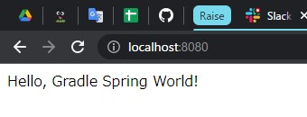
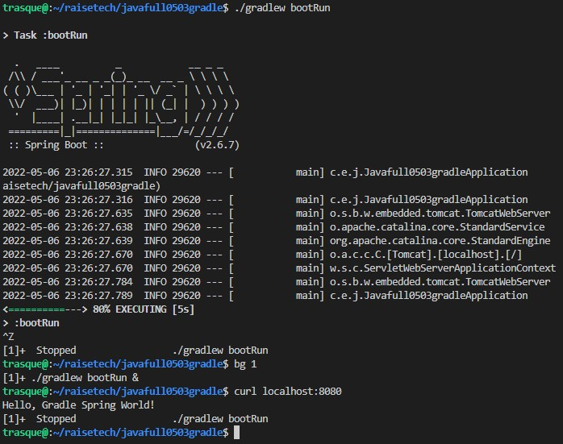

# 課題3 再 Gradle で構築
- 第3回の課題を改めてGradleで構築しました

## 構成要件（Spring Initializrで生成）
- Spring Boot 2.6.7
- Java 11
- 依存関係：Spring Web

## 起動手順
1. ターミナルでこのプロジェクトディレクトリに移動する
2. `./gradlew build` でビルドする
3. `./gradlew bootRun` で実行する

## 実行確認
- ブラウザで `localhost:8080` にアクセスし出力を確認しました

- コマンドラインから `curl localhost:8080` でアクセスし出力を確認しました

